# Web Interface Guide

Slurpee includes a built-in web dashboard for managing events, subscribers, API secrets, and logging configuration. The interface uses HTMX for dynamic updates and DaisyUI for styling.

## Login

Navigate to your Slurpee instance (default: `http://localhost:8005`). You'll be redirected to the login page.

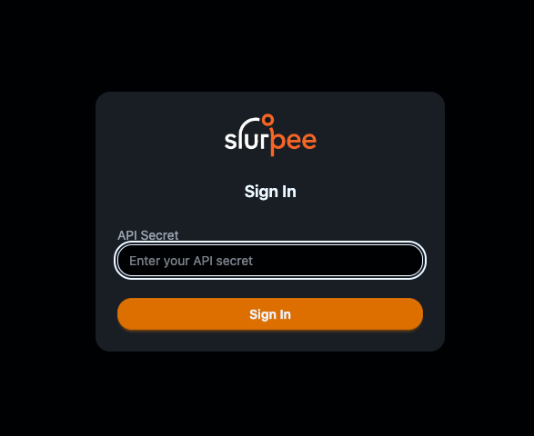

Enter the admin secret (the `ADMIN_SECRET` environment variable configured on the server). On success, a session cookie is set and you're redirected to the events page.

To log out, use the Logout button at the bottom of the sidebar.

## Events

### Event list

The events page shows a searchable, filterable list of all events.

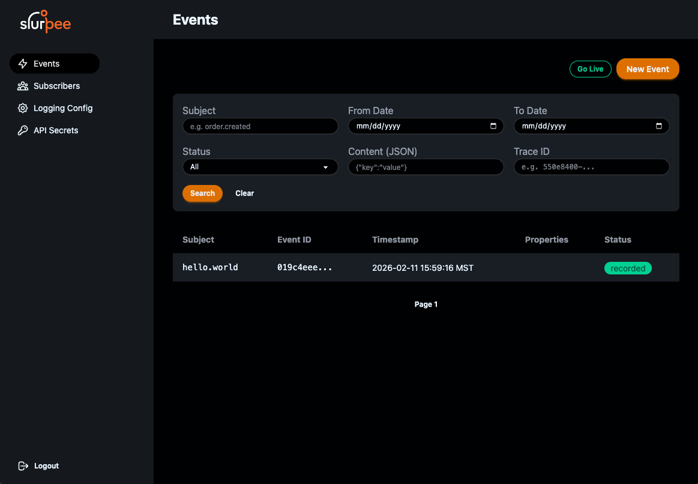

**Filters:**

- **Subject** — filter by event subject (exact match or partial)
- **Delivery status** — filter by status (pending, delivered, partial, failed, recorded)
- **Date range** — filter events by timestamp (From Date / To Date)
- **Content (JSON)** — search within event data JSON
- **Trace ID** — find events by trace ID

Use the **Go Live** button to enable real-time updates via Server-Sent Events (SSE). New events appear automatically and delivery status changes are reflected live.

### Event detail

Click an event to view its full details:

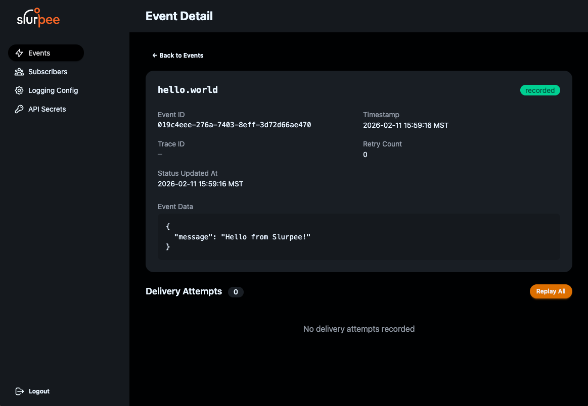

- **Subject and status** — displayed prominently at the top with a status badge
- **Metadata** — event ID, timestamp, trace ID, retry count, status updated at
- **Event data** — the complete JSON payload in a formatted code block
- **Delivery attempts** — a log of every delivery attempt with request/response details, plus a **Replay All** button to re-deliver to all subscribers

### Create event

Click **New Event** from the events list to open the create event dialog.

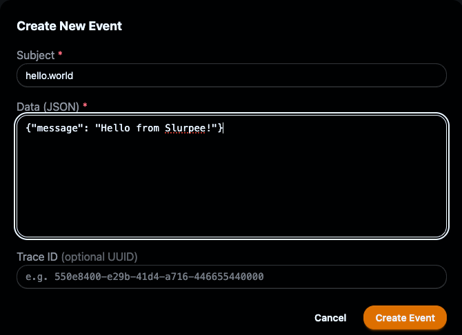

Fill in the subject (required), data as JSON (required), and an optional trace ID.

## Subscribers

### Subscriber list

The subscribers page shows all registered subscribers with their endpoint URLs, max parallel setting, subscription count, and creation timestamp.

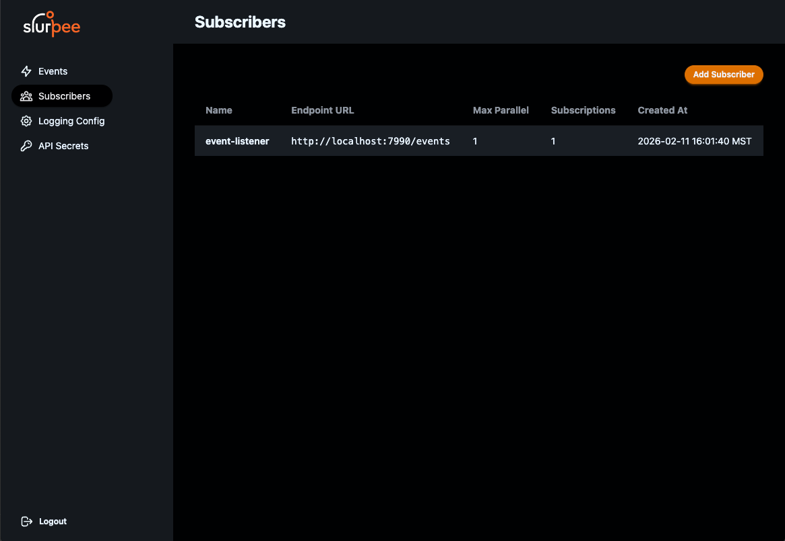

Click **Add Subscriber** to register a new subscriber.

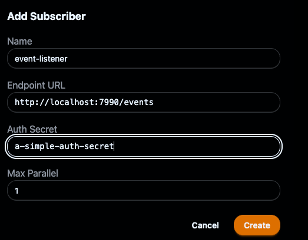

Provide a name, endpoint URL, auth secret (sent in the `X-Slurpee-Secret` header on deliveries), and max parallel deliveries.

### Subscriber detail

Click a subscriber to view and edit its configuration.

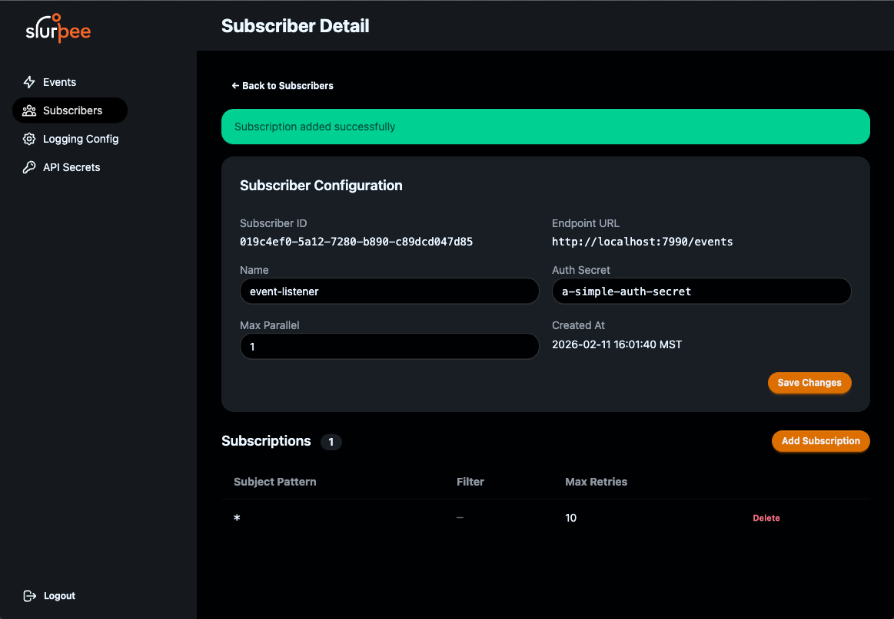

Editable fields:
- **Name** — human-readable label
- **Auth Secret** — the shared secret for webhook verification
- **Max Parallel** — concurrent delivery limit

Click **Save Changes** to update.

### Subscription management

The lower section of the subscriber detail page shows all subscriptions. Click **Add Subscription** to create a new one.

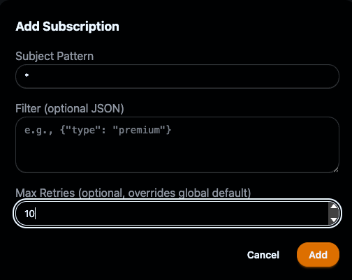

- **Subject Pattern** — pattern to match event subjects (e.g., `*` for all, `order.*` for order events)
- **Filter (optional JSON)** — only deliver events where data matches these key-value pairs (AND logic)
- **Max Retries** — optional override for the server's global retry setting

Each subscription can be deleted individually from the list.

## API Secrets

### Secret list

The API Secrets page shows all secrets with their names, IDs, subject patterns, associated subscribers, and creation timestamps.

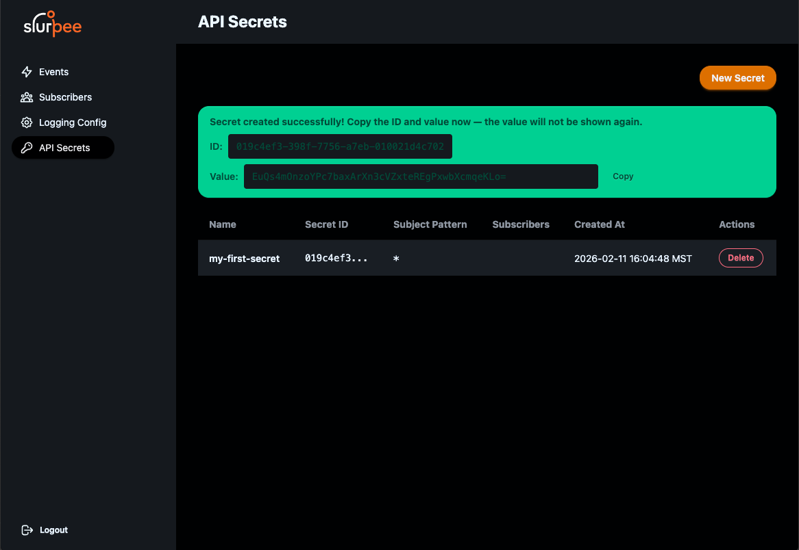

After creating a secret, the **ID and plaintext value are displayed once** in a banner. Copy both immediately — the value cannot be retrieved later.

### Create secret

Click **New Secret** to open the creation dialog.

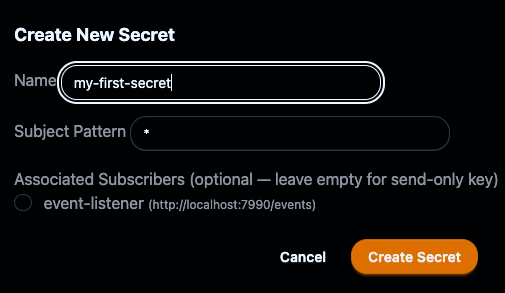

- **Name** — a label for identifying this secret (e.g., "payment-service-prod")
- **Subject Pattern** — restricts which subjects this secret can publish to (e.g., `payment.*`)
- **Associated Subscribers** — optionally scope the secret to specific subscribers (leave empty for a send-only key)

### Edit secret

You can update a secret's name, subject pattern, and subscriber associations. The secret value itself cannot be changed — create a new secret if needed.

### Delete secret

Delete a secret using the **Delete** button in the Actions column. This revokes access immediately.

## Logging Configuration

The logging page lets you configure per-subject property extraction for server logs.

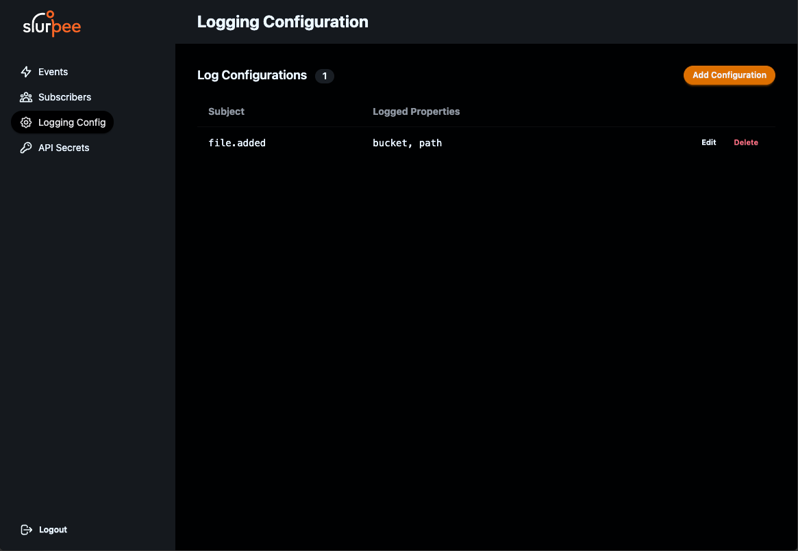

When Slurpee receives an event, it always logs the event ID and subject. With logging configuration, you can additionally extract and log specific fields from the event data.

Click **Add Configuration** to create a new entry, or **Edit** to modify an existing one.

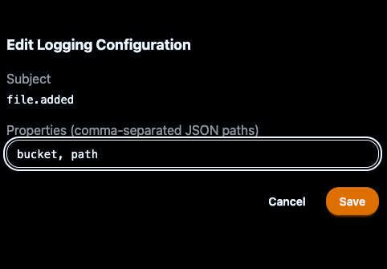

- **Subject** — the event subject to configure (exact match)
- **Properties** — comma-separated list of top-level JSON keys to extract from event data

**Example:** For subject `file.added`, configure properties `bucket, path`. When a matching event is received, the log line will include these fields extracted from the event data.

Configurations are upserted by subject — setting properties for an existing subject updates the configuration.
